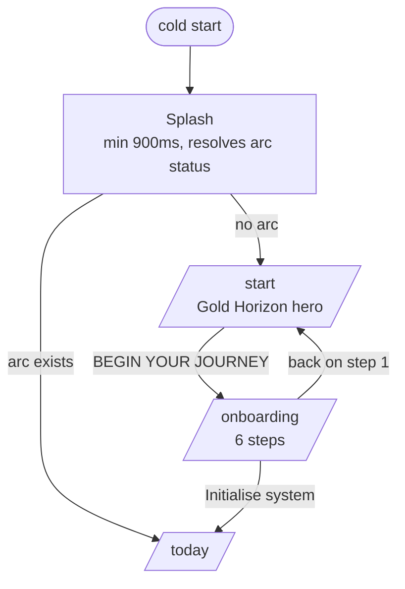
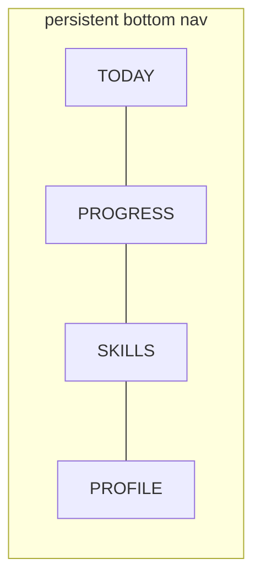
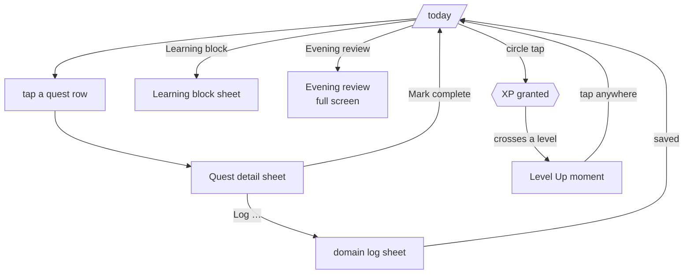
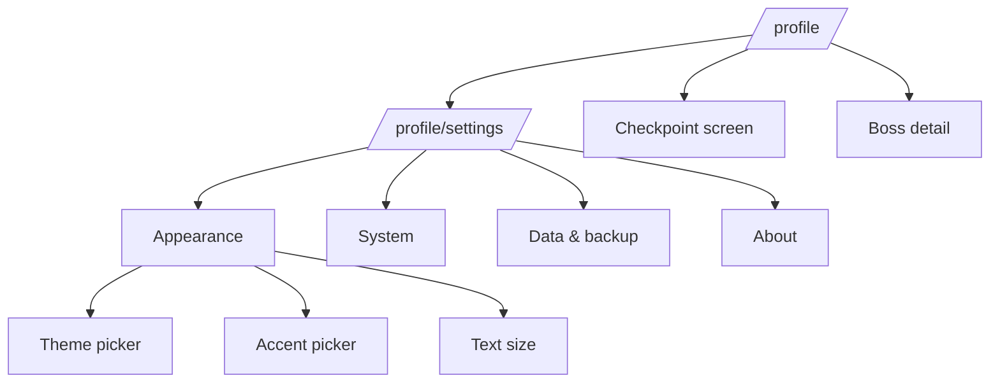

# Navigation Flow

Every route, sheet, moment and transition in one place. This is the contract the router,
the `PageTransition` component and the back-button behaviour all implement.

Two rules govern everything below:

1. **The four tabs are the only persistent navigation.** Everything else is a child route,
   a sheet, or a moment layered above them.
2. **Depth is always reversible.** Every surface you can enter, you can leave with a
   gesture that a phone user already knows: back, swipe-down, or tap-outside.

---

## 1. Boot path



- **Splash** is not a route. It replaces `App.tsx`'s current blank
  `status === 'loading'` div and unmounts once *both* the arc status has resolved **and**
  900 ms has elapsed — so it reads as a deliberate boot, never a flicker.
- `/start` redirects to `/today` if an arc exists. A returning user never sees it.
- `/onboarding` redirects to `/today` if an arc exists. Unchanged from today's behaviour.
- Any unknown path → `/today` when an arc exists, `/start` when it does not.

---

## 2. The tab graph



Switching tabs is **lateral**: no back-stack depth is added, and each tab keeps its own
scroll position. Tapping the active tab scrolls it to top.

| Tab | Route | Sub-surfaces |
|---|---|---|
| TODAY | `/today` | 8 sheets, 1 full-screen review, 6 moments |
| PROGRESS | `/progress` | SYSTEM / REALITY segmented; weekly review |
| SKILLS | `/skills` | flat lists; benchmark card |
| PROFILE | `/profile` | checkpoint, boss, data cards, **`/profile/settings`** |

---

## 3. Depth from each tab

### 3.1 TODAY — the core loop



The six domain log sheets are `career`, `dsa`, `build`, `training`, `sleep`, `attention`.
A quest row's circle completes directly; the row body opens the detail sheet. Those are two
separate ≥44px targets and stay that way.

### 3.2 PROFILE → SETTINGS



Settings is a **child route of the profile tab**, so the bottom nav stays visible and the
frozen four-tab contract is untouched. Appearance sub-pickers are pushed routes on mobile,
not modals — they are content, not interruptions.

---

## 4. Transition grammar

Direction encodes relationship. The user should be able to feel where they are without
reading.

| Edge | Motion | Duration |
|---|---|---|
| Splash → Start / Today | cross-fade + 1.02 → 1.0 scale | 420 ms |
| Start → Onboarding | push left, hero parallaxes at 0.4× | 320 ms |
| Onboarding step → step | push left / right, step rail advances | 260 ms |
| Tab → Tab (lateral) | fade + 14px rise, no horizontal travel | 200 ms |
| Tab → child route (Settings, Checkpoint) | push left | 280 ms |
| Child → parent (back) | push right | 240 ms |
| Any → Sheet | scrim fades, sheet springs up from below | 300 ms spring |
| Sheet → dismissed | drag-follow, then settle down | follows gesture |
| Any → Moment | scrim to full black, panel `ring-pop` | 260 + 240 + 200 ms |
| Moment → dismissed | fade out | 200 ms |

Lateral moves never travel horizontally; hierarchical moves always do. That single rule is
what makes the app feel navigable rather than merely animated.

At `[data-motion="reduced"]` every row above collapses to an instant state change with a
120 ms opacity fade, and nothing else.

---

## 5. Back-button and gesture contract

The app is an installed PWA, so hardware/gesture back must behave:

| Context | Back does |
|---|---|
| Sheet open | closes the sheet, stays on the screen |
| Moment showing | dismisses the moment |
| `/profile/settings/*` sub-picker | returns to Settings |
| `/profile/settings` | returns to `/profile` |
| A tab root | leaves the app (does **not** cycle tabs) |
| `/onboarding` step > 1 | previous step |
| `/onboarding` step 1 | `/start` |

Sheets and moments push a history entry so back closes them instead of leaving the screen.
This is the single most common PWA navigation bug and it is explicitly in scope.

---

## 6. Entry points that bypass the tabs

`vite.config.ts` already declares three PWA shortcuts. They must resolve to real
destinations rather than 404 into the fallback:

| Shortcut | Declared URL | Resolves to |
|---|---|---|
| Log problem | `/log/problem` | `/today` with the DSA log sheet open |
| Log application | `/log/application` | `/today` with the career log sheet open |
| Evening review | `/review` | `/today` with the evening review open |

Each redirects to `/start` when no arc exists.

---

## 7. Where art appears along the path

Mood follows meaning (`design/00-DESIGN-SYSTEM.md` §2):

```
Splash        Blue    boot
Start         Gold    start-hero          ← the promise
Onboarding    Blue    onboarding
Today         Blue    today (corner bleed)
Level Up      Blue    level-up            ← effort rewarded
Rank Advanced Gold    rank                ← evidence accepted
Checkpoint    Gold    checkpoint          ← the report
Boss          Boss    boss / boss-throne
Progress      Blue    progress
Skills        Blue    skills
Settings      none    flat, quiet — a settings screen is not a stage
```
